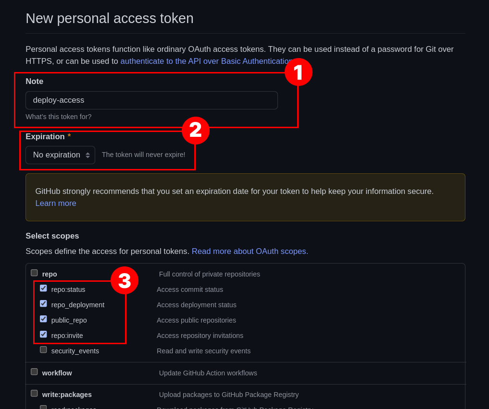
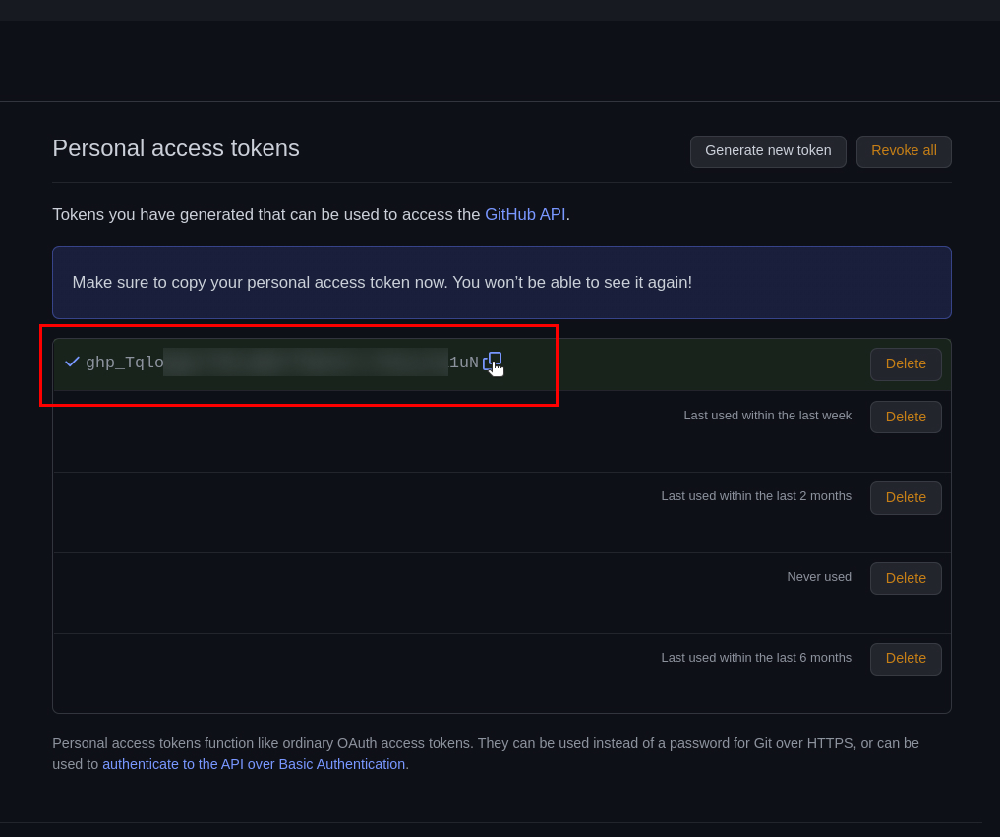
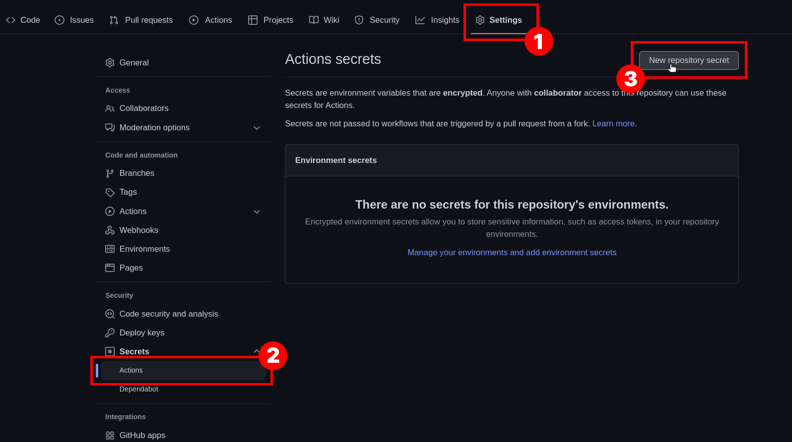
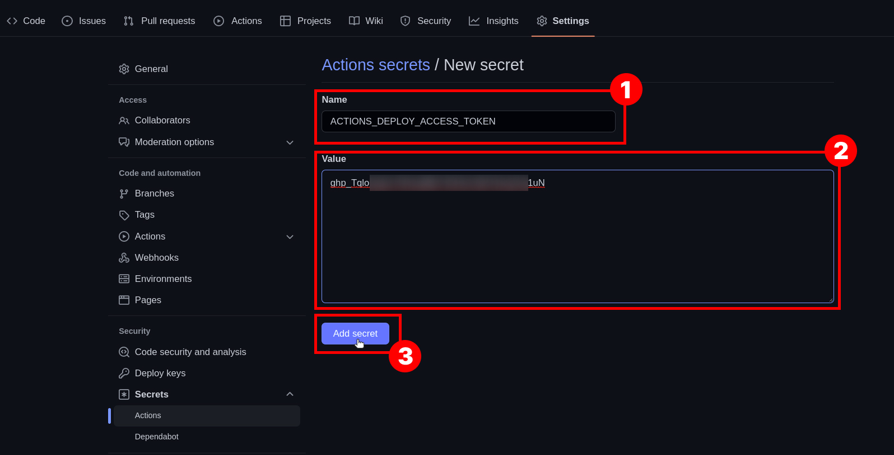
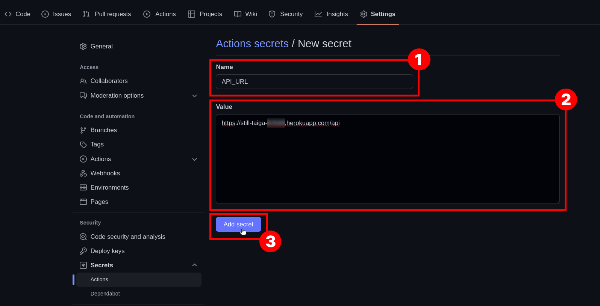
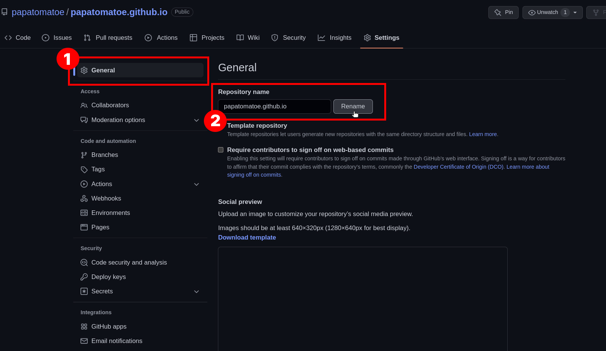
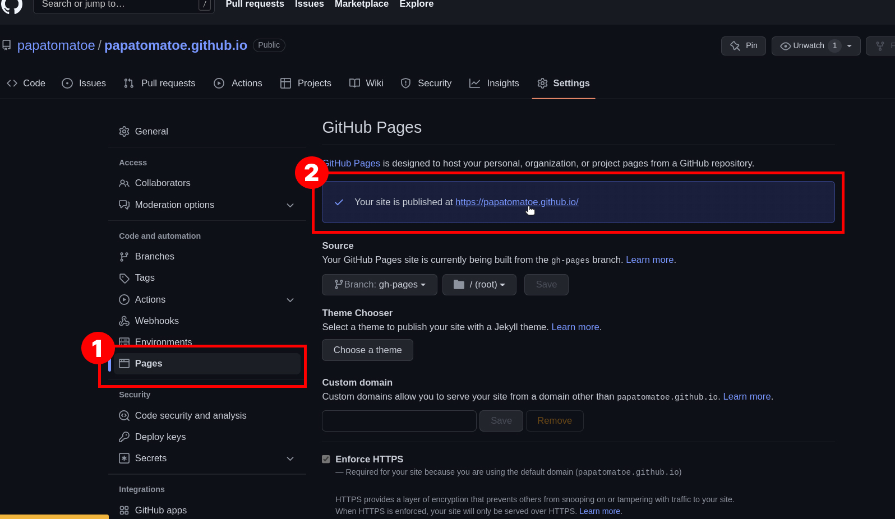

# Деплой в Github Pages

1. Устанавливаем `gh-pages`:

   ```bash
   npm i -DE gh-pages
   ```

2. Добавляем скрипты в `package.json`

   ```json
    // ...
    "homepage": "https://<username>.github.io",
    // ...
    "scripts": {
        // ...
        "predeploy": "npm run build",
        "deploy": "gh-pages -d build"
    }
   ```

3. В корень проекта добавляет папку `.github`, в этой папке создаем папку `workflows`, и в этой папке файл `ci.yml` _(полный путь `.github/workflows/ci.yml`)_

   ```yml
   name: CI/CD

   on:
     push:
       branches: ['main']
     pull_request:
       branches: ['main']

   jobs:
     build:
       runs-on: ubuntu-latest

       strategy:
         matrix:
           node-version: [16.x]

       steps:
         - name: Checkout repository
           uses: actions/checkout@v3

         - name: Use Node.js ${{ matrix.node-version }}
           uses: actions/setup-node@v3
           with:
             node-version: ${{ matrix.node-version }}
             cache: 'npm'

         - name: Install dependencies
           run: npm install

         - name: Build
           run: npm run build
           env:
             API_URL: ${{ secrets.API_URL }}

         - name: Deploy
           run: |
             git config --global user.name $user_name
             git config --global user.email $user_email
             git remote set-url origin https://${github_token}@github.com/${repository}
             npm run deploy
           env:
             user_name: 'github-actions[bot]'
             user_email: 'github-actions[bot]@users.noreply.github.com'
             github_token: ${{ secrets.ACTIONS_DEPLOY_ACCESS_TOKEN }}
             repository: ${{ github.repository }}
             API_URL: ${{ secrets.API_URL }}
   ```

4. Коммитим и пушим

   ```bash
   git add .
   git commit -m "add ci/cd"
   git push origin main
   ```

5. Создаем **Personal access token** вот [тут](https://github.com/settings/tokens). Нажимаем кнопку **Create new token**, на следующей странице устанавливаем такие параметры (Note: deploy-access, Expirations: No expiration и четыре галки repo). В самом низу кнопка сохранить...
   

6. Копируем токен, больше его нам не покажут, придется генерировать снова...
   

7. Идем в настройки репозитория во вкладку `settings -> secrets -> actions`, нажимаем на кнопку **New repository secret**
   

8. На следующей странице добавляем: name: ACTIONS_DEPLOY_ACCESS_TOKEN, value: наш скопированный токен
   

9. Добавляем еще один секрет на это раз это name: API_URL value: ссылка на рабочий API который ранее задеплоили на heroku.
   
10. Далее переходим во вкладку **General** и переименовываем репозиторий: `<username>.github.io`
    
11. Далее идем во вкладку **Pages** и видим: `Your site is published at https://<username>.github.io/`, пробуем проити по ссылке, должен открыться наш сайт
    

---

[назад](../README.md)
