# Деплой в Netlify

1. Идем на сайт [app.netlify.com](https://app.netlify.com/)

2. Авторизуемся через аккаунт **Github**
   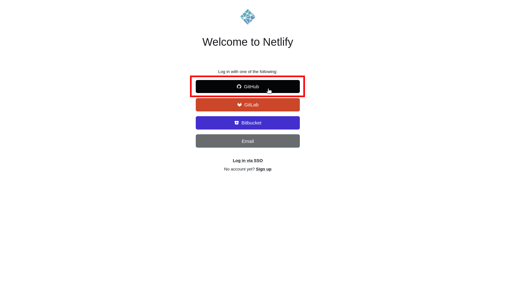

3. Заполняем информацию о себе
   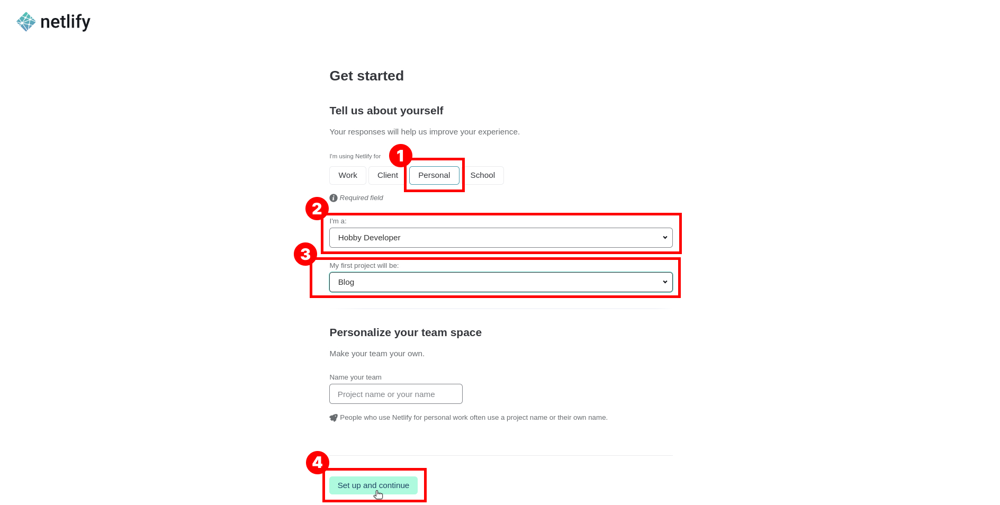

4. Выбираем импорт существующего репозитория 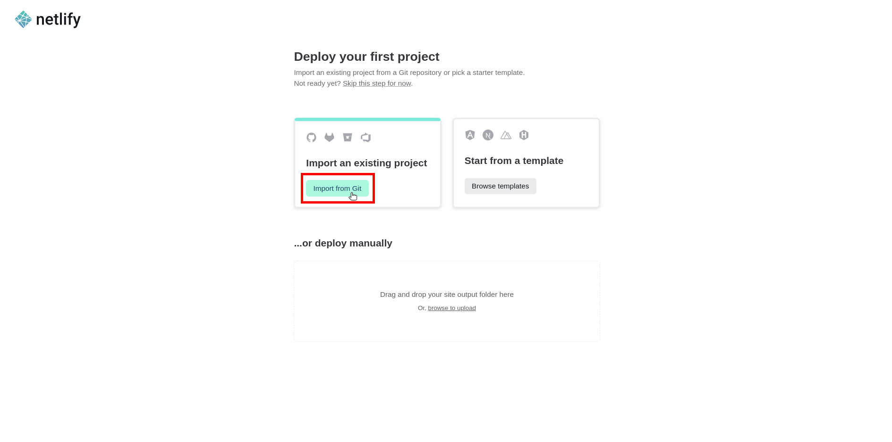

5. Коннектим Github к Netlify 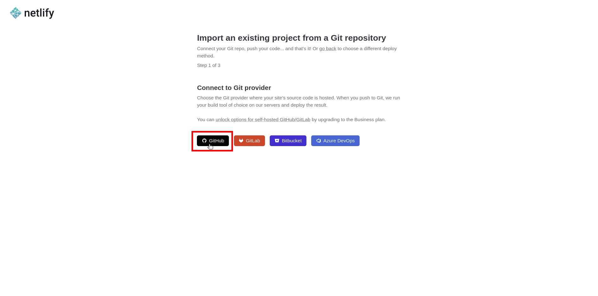

6. Ищем нужный нам репозиторий и кликаем на него 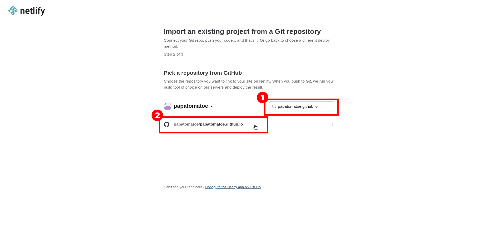

7. Настраиваем деплой, выбираем ветку. Нажимаем кастомизация параметров сборки 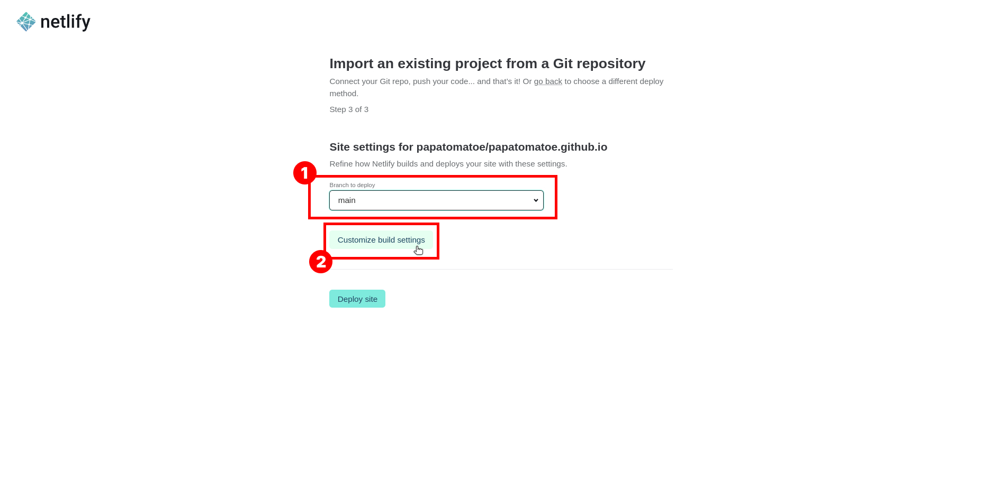

8. Меняем publish directory на `build/` и жмем на кнопку "Кастомизировать больше настроек" 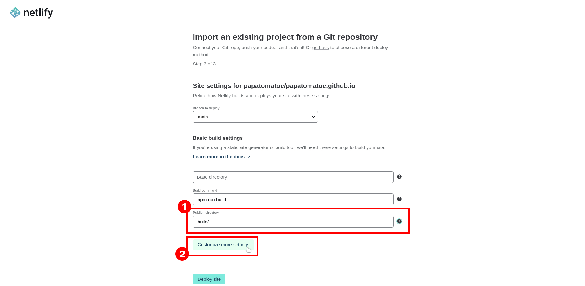

9. Нажимаем на кнопку "Новые переменные" 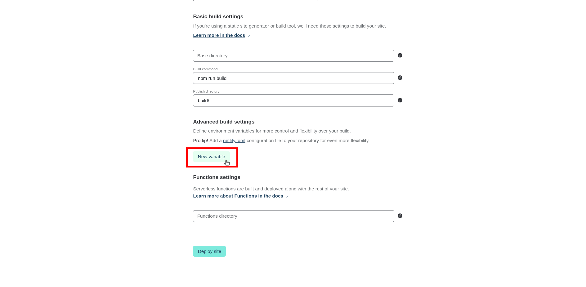

10. Вводим название переменной, у нас это ссылка на API `API_URL` и в соседнем поле адрес API. Ниже нажимаем кнопку "Задеплоить сайт" 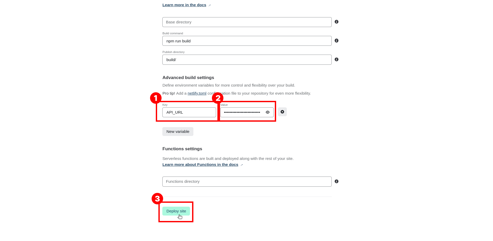

11. Ждем пока все задеплоится 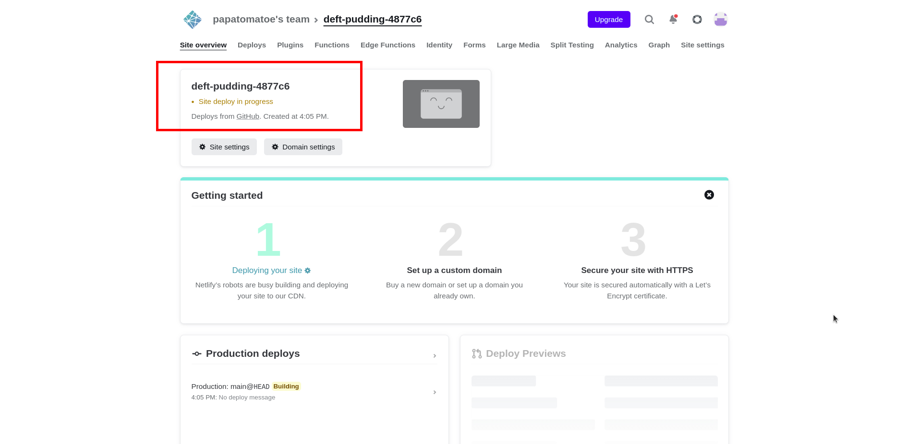

12. После здесь появится ссылка на нашу сборку приложения, можно перейти и проверить. 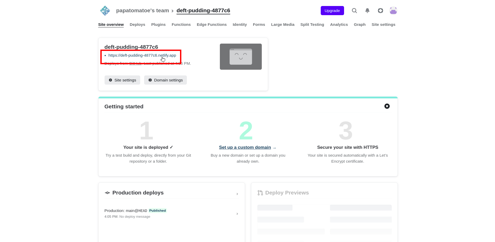

---

[назад](../README.md)
